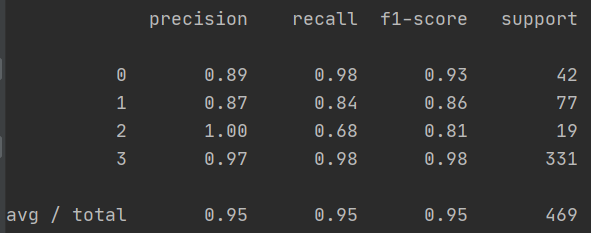

# 高空抛物检测

## 前言

该项目主要实现了对于布署在住宅小区中的高空抛物事件的检测。

因为项目是导师和公司进行合作的，且目前作为一款实际的产品，故在此不贴出实现的检测代码，只大致描述一下所采用的技术方案与实际的检测效果。

如需交流探讨，可通过邮箱联系我，我们一起探讨探讨：zhuchengchao.zj@outlook.com

## 技术方案

算法的处理流程大致可以分为如下几步：

1. 对视频流的抽帧并解码；
2. 高斯混合背景建模法建立背景模型，据此获取运动前景；
3. 通过卡尔曼滤波完成运动目标跟踪，并记录运动轨迹；
4. 在跟踪期间记录物体的前景图像块，利用图像分类网络排序干扰物体；
5. 对记录运动轨迹通过预训练的SOM网络，排除不符合抛物运动轨迹的记录。

其中 4.5 两点主要在事件布署场景下误报事件太多而采取的两个策略，能有效的对误报事件的抑制。

**说明**：

1. 关于图像的处理基本都是采用了 OpenCV  库；

   > 且为了提升处理速度，采用了 CUDA + OpenCV

2. 关于深度学习的处理部分，通过 Pytorch 搭建的网络。

## 实际检测

在此处放几个实际检测的案例仅供参考

### 摄像头的安装

> 这是当时在布署地随便拍了个安装点

### 实际检测

> 说明1：下述事件都是被检测到，然后再去下载录像后在本地跑的结果；
>
> 说明2：下述事件都是在小区1中发生的事件，该小区的楼层较低，比如容易检测；而还有小区2都是高楼层的检测，由于本人目前不在学校，视频素材都是学校的台式机上，故等回学校了再对事件进行补充。

**事件1：一次正常的抛物事件**

**事件2：略高楼层中的一次抛物事件**

**事件3：下雨天的测试**

### 误报解决

此处列出几个误报事件，结合并结合正常的抛物事件的轨迹对误报事件进行排除。

**误报事件1：飞鸟**

**误报事件2：树叶**

**误报事件3：被子**

**解决方案：**

通过 SOM（自组织映射神经网络） 对不同运动的轨迹进行分析

**SOM网络结构：**

**轨迹展示：**

**原始轨迹：**

在验证算法可行性阶段，总共从视频序列中获取了469 条轨迹，分为 4 类：抛物、鸟、树叶、衣服被单。

**SOM分类结果：**

> * 0：抛物；
> * 1：鸟；
> * 2：树叶
> * 3：衣服棉被
>
> 效果好到我都震惊:heart: